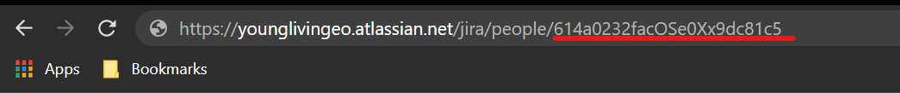
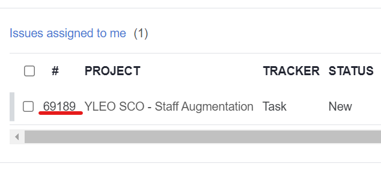

# Tempo Redmine Sync
Tool to write activities once and publish them in Tempo and Redmine. This is intended for Unosquare vendors

* [Usage](#usage)
* [Reference](#reference)
    * [Redmine API Docs](#redmine-api-docs)
    * [Tempo API Docs](#tempo-api-docs)
    * [How To Get My Jira Account ID?](#how-to-get-my-jira-account-id)
    * [How To Generate My Tempo API Key?](#how-to-generate-my-tempo-api-key)
    * [How To Get My Redmine API Key?](#how-to-get-my-redmine-api-key)
    * [How To Get My Redmine Issue ID?](#how-to-get-my-redmine-issue-id)
    * [Redmine Activity IDs](#redmine-activity-ids)

## Usage

1. Set up the next environment variables, if any of those is not present, the tool won't run

    | Variable          | How to get it?                                           |
    | ------------------|----------------------------------------------------------|
    | REDMINE_API_TOKEN | [Link](#how-to-get-my-redmine-api-key)                   |
    | REDMINE_ISSUE_ID  | [Link](#how-to-get-my-redmine-issue-id)                  |
    | TEMPO_API_TOKEN   | [Link](#how-to-generate-my-tempo-api-key)                |
    | JIRA_ACCOUNT_ID   | [Link](#how-to-get-my-jira-account-id)                   |
    | ACTIVITIES_FILE   | This is the path of your `activities.json` on your local |

2. Fill out the `activities.json`, you can use the [template](./docs/activities.json) on this repo. Every activity on the `activities` array must match these specs

    | Field            | Type   | Comments                        |
    | -----------------|--------|---------------------------------|
    | date             | String | Date of the activity. Must follow this format YYYY-MM-dd |
    | description      | String | Any string describing your activity. Limited to 255 characters due to Redmine API restrictions |
    | spent_time       | Float  | Hours spent on the activity. This follows the same convention used on Redmine UI. Always use the float notation even when dealing with Ints. Eg. Place `1.0` instead of just `1` |
    | jira_issue       | String | The Jira issue ID to which will be linked to Tempo worklog |
    | redmine_activity | Int    | The activity type for the Redmine log. Find the right ID in [this](#redmine-activity-ids) list |

    * Example of how an activity in the file will looks like

    ```json
    {
        "activities": [
            {
                "date": "2022-02-01",
                "description": "Some YL API development",
                "spent_time": 1.0,
                "jira_issue": "SCO5-1234",
                "redmine_activity": 9
            }
        ]
    }
    ```
    
3. Build the container, just in case you don't have it already
    `docker build -t tempo-redmine-sync .`

4. Run the container. You can use either the the `run.ps1` or `run.sh` scripts depending on your shell. DO NOT change the target mount of the volume, the application spects the activities file right on `/app` directory.

## Reference

### Redmine API Docs
Redmine API offical usage https://www.redmine.org/projects/redmine/wiki/Rest_api

### Tempo API Docs
Tempo API official usage https://apidocs.tempo.io/

### How To Get My Jira Account ID?
- Go to https://younglivingeo.atlassian.net/jira/your-work -> Then click on your profile picture -> The chose "Profile"
- Your account ID will be the last ID on the URL
    

### How To Generate My Tempo API Key?
1. Go to https://younglivingeo.atlassian.net/plugins/servlet/ac/io.tempo.jira/tempo-app#!/configuration/api-integration
2. Select "New Token"
    - Give a name to your token
    - Select custom access and chose "View" and "Manage Worklogs"
    - Expiration date is up to you, but 90 days is recomended
    - Copy your token and save it in a secure place

### How To Get My Redmine API Key?
1. Go to https://dev.unosquare.com/redmine/my/account
2. Copy your token from the "API access key" section at the right of the screen

### How To Get My Redmine Issue ID?
1. Go to https://dev.unosquare.com/redmine/my/page
2. Your Issue ID is  at the right side of the project name. Eg
    

### Redmine Activity IDs

| ID | Description |
| ----|------------|
| 10  | Meeting |
| 14  | Research |
| 50  | IT Support |
| 8   | Design |
| 9   | Development |
| 11  | Test Case Design |
| 12  | Testing |
| 10  | Meeting |
| 13  | Reporting |
| 14  | Research |
| 50  | IT Support |
| 48  | Vacation/PTO/Holiday |
| 142 | Comp Time |
| 351 | Maintenance |
